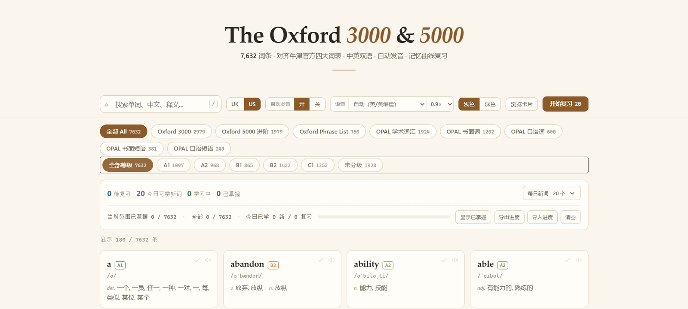

# The Oxford 3000 & 5000 · 学习手册

> 牛津官方四大词表，7632 条，中英双语 · 英美双音标 · 记忆曲线复习
> **在线使用 → <https://rapids2.github.io/oxford5000/>**

一个单页的英语词汇学习网站。所有词条严格对齐 [Oxford Learner's Word Lists](https://www.oxfordlearnersdictionaries.com/wordlists/) 官方数据，
不联网也能用，学习进度存在本机浏览器里。



---

## 收录内容

| 词表 | 条数 | 说明 |
| --- | --- | --- |
| **The Oxford 3000™** | 2979 | 最核心的英语词汇，A1–B2 |
| **The Oxford 5000™**（进阶部分） | 1979 | 在 3000 之上扩展的 B2–C1 词汇 |
| **Oxford Phrase List** | 750 | 最重要的搭配与短语，A1–C1 |
| **OPAL**（Oxford Phrasal Academic Lexicon） | 1924 | 学术英语词汇，分书面词 1202 / 口语词 600 / 书面短语 381 / 口语短语 249 |
| **合计** | **7632** | |

**每一条**都有中文释义、英文释义、英文例句 + 中文翻译、CEFR 等级、英式与美式音标——零缺失。

## 功能

- **四表分区浏览**，按 CEFR 等级（A1–C1）筛选，OPAL 可再按 sublist 与功能类别细分
- **全文搜索**：单词、中文、英文释义都能搜，按 `/` 直接聚焦
- **英美双音标**：`dance` `/ˈdɑːns/` vs `/ˈdæns/`、`schedule` `/ˈʃedjuːl/` vs `/ˈskedʒuːl/`，切换 UK/US 时**发音也跟着换**
- **发音**：可选择系统语音（自动把云端神经语音排在前面）、可调语速；点例句朗读整句
- **卡片练习**：翻卡背词，切卡自动读词，翻面自动读例句；可开**乱序**（`X`），每次进入的词序都不同，避免按固定顺序看到疲倦
- **检测**：四种题型可混合出题——看英文选中文 / 看中文选英文 / 拼写 / 听音选词；范围可选「当前筛选」或「只测学过的词」，10 / 20 / 50 题；答完给正确率与错题清单，错题可一键加入复习计划
- **记忆曲线复习**：SM-2 间隔重复。四档评分（忘记 / 困难 / 认识 / 简单），每档标出下次复习时间；间隔拉到 30 天自动"出师"，此后不再出现
- **每日新词额度**可调（5–200），已掌握的词默认隐藏，进度可导出导入
- **深色模式**、**PWA**：手机"添加到主屏幕"后像 App 一样打开，断网可用

## 数据来源与版权

- 词表归属与 CEFR 分级：[Oxford Learner's Dictionaries](https://www.oxfordlearnersdictionaries.com/wordlists/)。
  The Oxford 3000™、Oxford 5000™、OPAL 均为 Oxford University Press 的商标，本项目仅作学习用途，与 OUP 无隶属关系。
- 释义、例句、中文翻译：[yingyuqiao-assets](https://www.npmjs.com/package/yingyuqiao-assets)（MIT）与 [ECDICT](https://github.com/skywind3000/ECDICT)（MIT）
- 英美音标：[ipa-dict](https://github.com/open-dict-data/ipa-dict)（MIT），并归一为牛津式记法
- 其余约 1100 条（官方短语表与 OPAL 中开源词库未覆盖的部分）为人工补写

本仓库代码以 MIT 协议开源。

## 本地运行

```bash
git clone https://github.com/rapids2/oxford5000.git
cd oxford5000
python3 -m http.server 8000
# 浏览器打开 http://localhost:8000
```

需要通过 http(s) 打开：直接双击 `index.html` 会因为浏览器安全限制读不到 `data.json`。

## 文件结构

```
index.html              页面与全部逻辑（无框架、无构建步骤）
data.json               词库 7632 条
sw.js                   Service Worker，离线缓存
manifest.webmanifest    PWA 配置
icon-*.png              图标
_headers                Netlify / Cloudflare Pages 缓存规则
DEPLOY.md               部署到其他平台的说明
```

## 更新词库

替换 `data.json` 后，把 `sw.js` 里的缓存版本号 `oxford-v1` 递增为 `oxford-v2`，
否则已经装过的用户拿到的仍是缓存中的旧数据。
